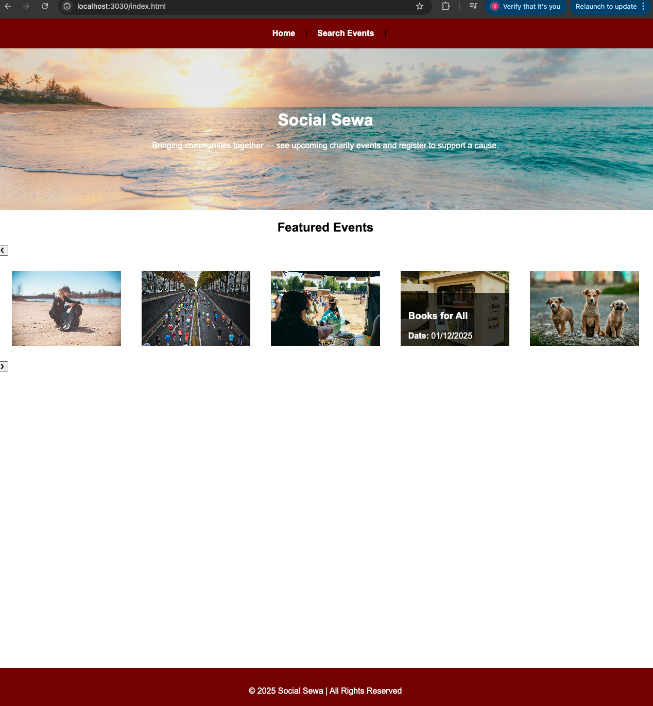
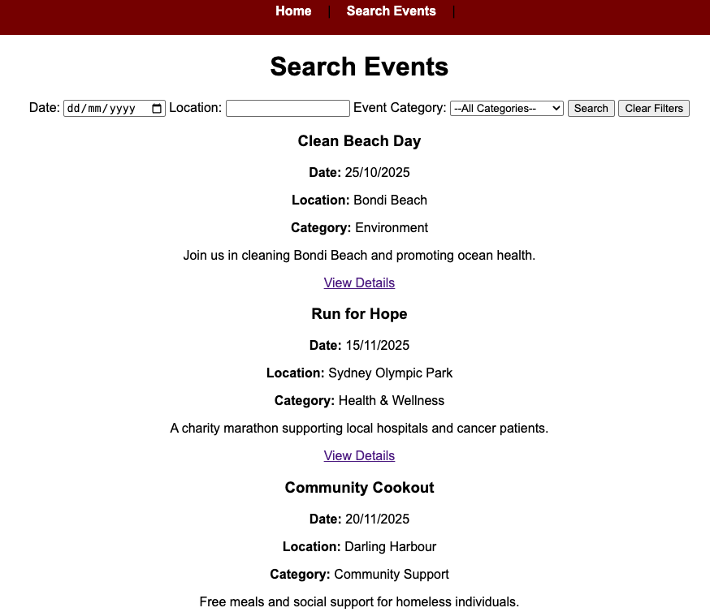
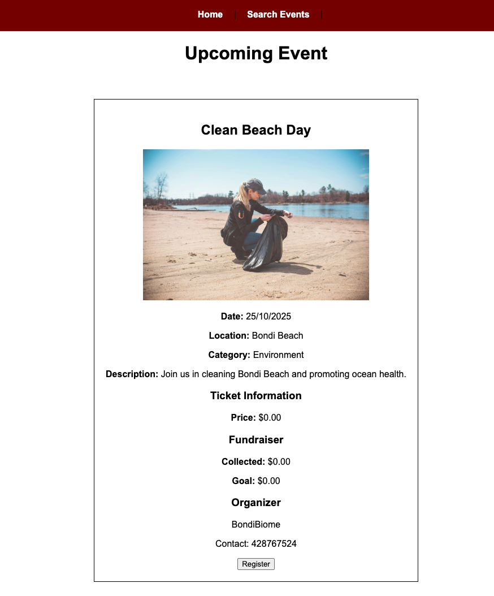

#SOCIAL SEWA
A simple fundraiser website to display upcoming charity events and let users view details 
----
##Description
Social Sew is a basic web project that shows upcoming charity events in a simple carousel.
Users can browse upcoming events, see details and navigate through them .
-------------------
#Specifications:
-HTML,CSS,JAavaScript
-NODE.js,Express,dotENV
-JSON for event handling 
#Features
-Carousel(work in progress)
-Next/Prev button
-Simple/User-Friendly design
-Search function based on location.date and category criterion
---
#Installation
1.Repo
2.Open folder and launch "index.html" in a browser
----
#Usage
-browse homepage
-hover through upcoming events to see event cards
-scroll to view details
----
#Screenshots

Homepage:

---
Search:

----
View Details:

----
#Author
Subhashish Shrestha 